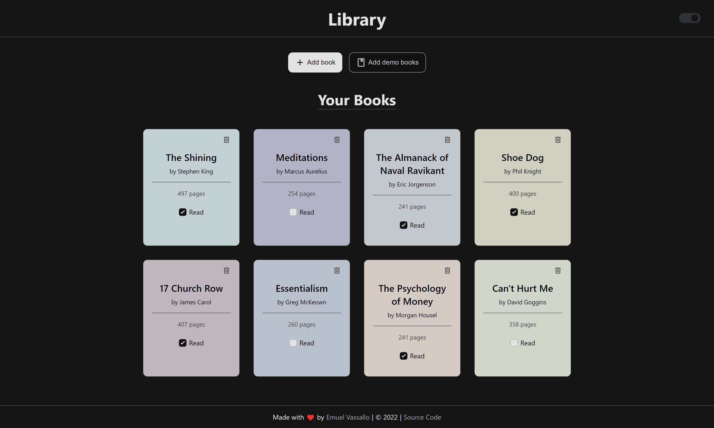
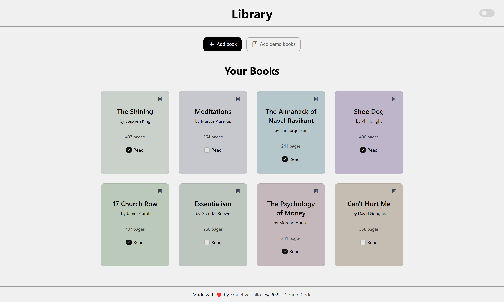

# Library

A simple library app focused on minimalism and aesthetics with pastel and muted colors. Created as part of The Odin Project's [curriculum](https://www.theodinproject.com/lessons/node-path-javascript-library).

### [Live Demo](https://emuel-vassallo.github.io/library/)

## Showcase

### Dark Theme

### Light Theme

## Built With

- HTML
- CSS
- JavaScript

## Features

- Minimalistic UI
- Pastel and muted colors
- Dark/Light theme toggle switch
- Empty library message
- Button to add four books for demo purposes
- Smooth animations and transitions
- New book modal form

## What I Learned

- Appending a container with elements using JavaScript
- Getting a random pastel color and assign it to each book instance
- Removing an item from a grid when clicking a button
- Using form data to create an element that includes it (book)
- Using object constructors and creating instances with it

## Credits and Inspiration

- [Modal popup box tutorial](https://sabe.io/tutorials/how-to-create-modal-popup-box)
- [Monochrome input components](https://dribbble.com/shots/18200426-Inputs-Component) by [Amir Baqian](https://dribbble.com/Amirbaqian)
- [White book favicon](https://icons8.com/icons/set/book-shelf--white) from [icons8.com](https://icons8.com/)
- [Checkbox for books](https://uiverse.io/detail/adamgiebl/proud-donkey-24) by [@adamgiebl](https://github.com/adamgiebl)
- [Checkbox for theme toggle](https://uiverse.io/detail/satyamchaudharydev/shy-earwig-18) by [@satyamchaudharydev](https://github.com/satyamchaudharydev)
- [Bookly](https://github.com/FrancisLangit/bookly) by [@FrancisLangit](https://github.com/FrancisLangit/)
